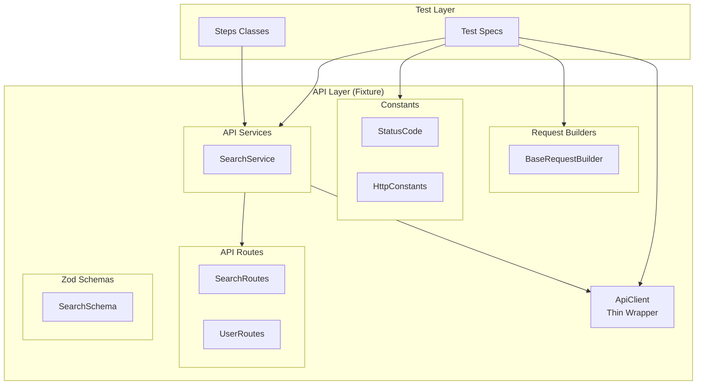

# API Utilities Pattern

Utilities for REST API operations in Playwright tests using Spec-Driven Development.

---

## Architecture



| Layer | Location | Purpose |
|-------|----------|---------|
| **ApiClient** | `utils/ApiClient.ts` | Thin wrapper around Playwright's `APIRequestContext` |
| **Builders** | `tests/api/builders/` | Type-safe request payload builders |
| **Constants** | `tests/api/constants/` | HTTP status codes, headers, content types |
| **Routes** | `tests/api/routes/*Routes.ts` | Centralized endpoint definitions |
| **Schemas** | `tests/api/schemas/*Schema.ts` | Zod schemas for response validation |
| **Services** | `tests/api/services/*Service.ts` | Domain-specific API calls (returns raw JSON) |
| **Fixture** | `tests/fixtures/api.fixture.ts` | Exposes `apiClient` + services |

---

## Components

### ApiClient (Thin Wrapper)

Mirrors Playwright's `APIRequestContext` methods exactly, only adding base URL handling:

```typescript
import { ApiClient } from '../utils/ApiClient';

// Same signature as request.get(), returns native APIResponse
const response = await apiClient.get('/search/page', {
    params: { q: 'earth', limit: 10 }
});

const data = await response.json();
expect(response.status()).toBe(200);
```

### 3. API Services (`tests/api/services/`)

Domain-specific logic.

**Rules**:
1.  **Return Raw `APIResponse`**: Never return parsed JSON. Allow tests to access headers/status.
2.  **No Assertions**: Services should only fetch data. Validation happens in tests.
3.  **Use Routes**: Use `tests/api/routes` for endpoints.

```typescript
// tests/api/services/UserService.ts
import { APIResponse } from '@playwright/test';
import { ApiClient } from '../../../utils/ApiClient';
import { UserRoutes } from '../routes';

export class UserService {
    constructor(private apiClient: ApiClient) {}

    async createUser(payload: object): Promise<APIResponse> {
        return this.apiClient.post(UserRoutes.CREATE, { data: payload });
    }

    async getUser(id: string): Promise<APIResponse> {
        return this.apiClient.get(UserRoutes.GET(id));
    }
}
```

### 4. Zod Validation in Tests (`tests/specs/`)
 
 Validation happens at the test level using the `assertSchema` helper, which parses the response and handles assertions automatically.
 
 ```typescript
 // tests/specs/user-api.spec.ts
 import { assertSchema } from '../../utils/parseResponse';
 import { UserSchema } from '../api/schemas';
 
 test('create user', async ({ userService }) => {
     // 1. Get raw response
     const response = await userService.createUser({ name: 'John' });
     
     // 2. Validate status
     await expect(response).toHaveStatusCode(201);
 
     // 3. Validate schema (asserts success and returns typed data)
     const data = await assertSchema(response, UserSchema, 'User Creation Response');
     
     // 4. Verify logic
     expect(data.name, 'Created user name should match input').toBe('John');
 });
 ```

### 5. Assertion Rules
 
 **Prohibited**: Generic assertions without messages.
 **Required**: Use custom matchers or explicit error messages.
 
 #### Custom Matchers
 
 We use custom Playwright matchers for common API assertions.
 
 ```typescript
 // ✅ Good (Custom Matcher)
 await expect(response).toHaveStatusCode(StatusCode.OK);
 
 // ✅ Good (Explicit Message)
 expect(result.pages, 'Search results should contain 10 items').toHaveLength(10);
 
 // ❌ Bad (Generic)
 expect(response.status()).toBe(200);
 ```

### Request Builders

Build complex payloads with the Builder pattern:

```typescript
import { BaseRequestBuilder } from '../api/builders';

class CreateUserBuilder extends BaseRequestBuilder<CreateUserRequest> {
    withName(name: string) { return this.with({ name }); }
}

const payload = new CreateUserBuilder()
    .withName('John')
    .build();
```

---

## Usage Patterns

### Pattern 1: Using SearchService in Tests

```typescript
import { test, expect } from '../fixtures/api.fixture';

test('search via API', async ({ searchService }) => {
    const results = await searchService.search('JavaScript');
    expect(results.pages.length).toBeGreaterThan(0);
});
```

### Pattern 2: Using Constants

```typescript
import { StatusCode } from '../api/constants';

const response = await apiClient.get('/users');
await expect(response).toHaveStatusCode(StatusCode.OK);
```

---

## Environment Configuration

API URL is configured per environment in `tests/data/environment/{env}.json`:

```json
{
    "api": {
        "apiUrl": "https://api.wikimedia.org/core/v1/wikipedia/en"
    }
}
```

---

## Files Reference

| File | Description |
|------|-------------|
| [ApiClient.ts](file:///c:/Users/m.novikov/Desktop/Playwright-SSD/Playwright-SDD/utils/ApiClient.ts) | Thin HTTP wrapper |
| [BaseRequestBuilder.ts](file:///c:/Users/m.novikov/Desktop/Playwright-SSD/Playwright-SDD/tests/api/builders/BaseRequestBuilder.ts) | Base builder class |
| [StatusCode.ts](file:///c:/Users/m.novikov/Desktop/Playwright-SSD/Playwright-SDD/tests/api/constants/StatusCode.ts) | HTTP status codes |
| [api.fixture.ts](file:///c:/Users/m.novikov/Desktop/Playwright-SSD/Playwright-SDD/tests/fixtures/api.fixture.ts) | API fixtures |
| [parseResponse.ts](file:///c:/Users/m.novikov/Desktop/Playwright-SSD/Playwright-SDD/utils/parseResponse.ts) | Schema validation helpers |
| [matchers.ts](file:///c:/Users/m.novikov/Desktop/Playwright-SSD/Playwright-SDD/utils/matchers.ts) | Custom Playwright matchers |
